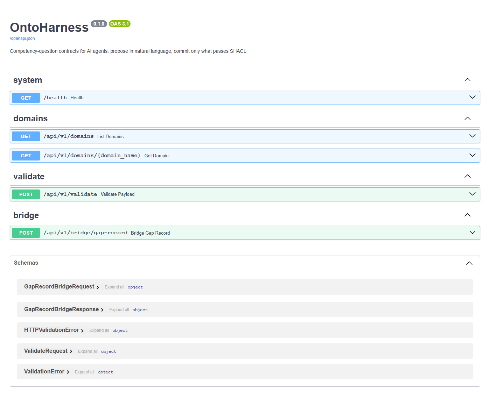
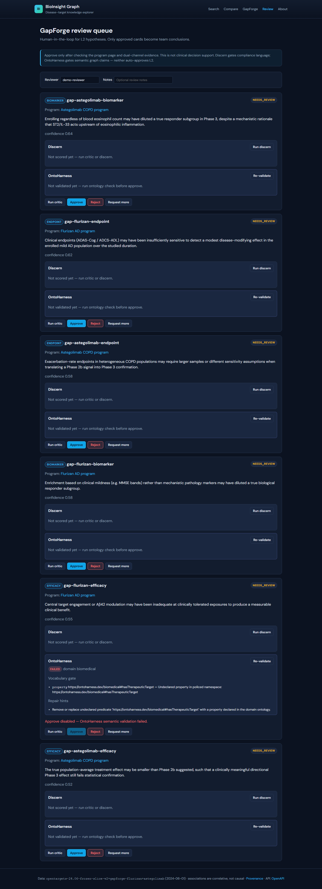
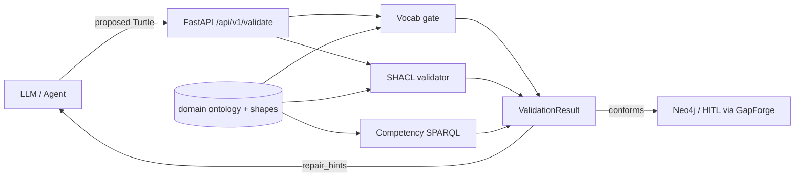

# OntoHarness

**Competency-question contracts for AI agents: propose in natural language, commit only what passes SHACL.**

LLMs propose graph mutations. OntoHarness validates them with a **closed-world vocabulary gate** plus **SHACL** before anything reaches Neo4j or a human review queue. All work happens in **your repos** — no upstream Spring PRs required.

[](LICENSE)
[](requirements.txt)
[](https://portfolio.lordkay.com)

---

## Why OntoHarness

Research and tooling in 2025–2026 converged on **Cognitive–Executive Separation**: LLMs propose; deterministic engines validate ([HyDRA](https://arxiv.org/html/2507.15917v2), [onto-correctness-bench](https://github.com/fabio-rovai/open-ontologies/tree/main/case-studies/onto-correctness-bench)). SHACL alone is **open-world** and blind to fabricated predicates. OntoHarness adds the missing **vocabulary gate** and ships as a composable sidecar for GapForge, BioInsight Graph, embabel-mcp, and Spring AI.

| Layer | Role |
|-------|------|
| **Cognitive** | LLM / agent proposes Turtle triples |
| **Executive** | OntoHarness vocab gate + SHACL |
| **Human** | HITL review (GapForge L2 gate) |
| **Commit** | Approved facts → `approved_rdf_turtle` export |

---

## Quick start

**Prerequisites:** Python 3.11+

```bash
git clone https://github.com/LordKay-sudo/ontoharness.git
cd ontoharness
py -3 -m venv .venv
.\.venv\Scripts\pip install -r requirements.txt   # Windows
# source .venv/bin/activate && pip install -r requirements.txt  # macOS/Linux

cp .env.example .env
py -3 -m pytest -q
py -3 -m uvicorn api.app.main:app --reload --port 8010
```

| URL | Description |
|-----|-------------|
| http://localhost:8010/docs | Interactive API |
| http://localhost:8010/api/v1/domains | Registered domains |
| http://localhost:8010/api/v1/validate | Validate RDF payload |
| http://localhost:8010/api/v1/bridge/gap-record | Project GapForge JSON → Turtle + validate |

### Bridge example (GapForge record → Turtle)

```bash
curl -s -X POST http://localhost:8010/api/v1/bridge/gap-record \
  -H "Content-Type: application/json" \
  -d "{\"record\":{\"id\":\"gap-1\",\"claim\":\"Endpoint gap\",\"confidence\":0.6,\"genes\":[{\"id\":\"ENSG1\",\"symbol\":\"BRCA1\"}],\"disease\":{\"id\":\"MONDO:1\",\"name\":\"AD\"}}}"
```

GapForge persists `approved_rdf_turtle` on HITL approve and exposes `GET /api/v1/export/approved-rdf?program_id=...`.

**Full stack demo:** [gapforge/docs/ONTOHARNESS_DEMO.md](https://github.com/LordKay-sudo/gapforge/blob/main/docs/ONTOHARNESS_DEMO.md) — one `docker compose` command for GapForge + OntoHarness + embabel-mcp.

### Demo screenshots



*Sidecar Swagger on `:8010` — vocab gate, SHACL validate, GapForge bridge.*



*Same failure surfaced in the review queue: undeclared `bio:hasTherapeuticTarget` blocks approve.*

More assets (WebM, terminal captures): [gapforge demo-recordings](https://github.com/LordKay-sudo/gapforge/tree/main/docs/demo-recordings) · [docs/demo/](docs/demo/README.md)

---

### Spring AI advisor (v0.4)

```java
var client = new OntoHarnessClient("http://localhost:8010");
var policy = OntologyValidationAdvisor.builder(client)
    .domain("biomedical")
    .failClosed(true)
    .validateOutput(true)
    .build();
var advisor = OntologyValidationAdvisor.advisor(policy).build();

var chatClient = ChatClient.builder(chatModel)
    .defaultAdvisors(advisor)
    .build();
```

Validates ` ```turtle ` fences in model output before returning to callers. Lives in `advisor/` — not upstream Spring AI.

### Validate example (valid)

```bash
curl -s -X POST http://localhost:8010/api/v1/validate \
  -H "Content-Type: application/json" \
  -d "{\"domain\":\"biomedical\",\"format\":\"turtle\",\"content\":\"@prefix bio: <https://ontoharness.dev/biomedical#> .\\nbio:g1 a bio:Gene ; bio:hasSymbol \\\"BRCA1\\\" ; bio:associatedWith bio:d1 ; bio:hasScore \\\"0.9\\\"^^<http://www.w3.org/2001/XMLSchema#decimal> .\\nbio:d1 a bio:Disease ; bio:hasIdentifier \\\"MONDO:1\\\" .\"}"
```

### Validate example (fabricated predicate — fails vocab gate)

An LLM might emit `bio:hasTherapeuticTarget`. SHACL often misses it. OntoHarness catches it:

```turtle
@prefix bio: <https://ontoharness.dev/biomedical#> .
bio:g1 a bio:Gene ;
    bio:hasTherapeuticTarget bio:d1 .
bio:d1 a bio:Disease .
```

Response includes `vocab_violations` and `repair_hints` for the agent repair loop.

---

## Architecture (v0.1)



### Runnable demo

With the API running on `:8010`:

```bash
py -3 examples/validate_demo.py
```

Shows a passing gene–disease graph, then a blocked LLM-style fabricated predicate (`bio:hasTherapeuticTarget`).

---

## Repository layout

```
ontoharness/
├── domains/biomedical/     # Reference OWL + SHACL + competency questions
├── validator/              # Vocab gate, SHACL engine, repair hints
├── api/app/                # FastAPI sidecar
├── advisor/                # Spring AI OntologyValidationAdvisor (v0.4)
├── bridge/                 # GapForge record → Turtle projector
├── examples/               # validate_demo.py — end-to-end API walkthrough
├── tests/
└── requirements.txt
```

---

## Roadmap

| Phase | Focus |
|-------|--------|
| **0.1** ✅ | Vocab gate + SHACL + FastAPI validate |
| **0.2** ✅ | MCP tools in embabel-mcp (`validate_proposal`, `get_repair_hints`, `bridge_gap_record`, `run_gap_ontology_validate`, `export_approved_rdf`) |
| **0.3** ✅ | GapForge HITL UI + L2 gate on propose/approve |
| **0.4** ✅ | Spring AI `OntologyValidationAdvisor` (post-call Turtle validation) |
| **0.5** ✅ | Neo4j ↔ RDF bridge (`POST /bridge/gap-record`, GapForge `GET /export/approved-rdf`) |
| **0.6** ✅ | Competency-question SPARQL gate (`competency_violations` on `/api/v1/validate`) |

---

## Ecosystem

| Repository | Role |
|------------|------|
| [bioinsight-graph](https://github.com/LordKay-sudo/bioinsight-graph) | Disease-target graph lineage |
| [gapforge](https://github.com/LordKay-sudo/gapforge) | HITL gap hypotheses |
| [embabel-mcp](https://github.com/LordKay-sudo/embabel-mcp) | MCP agent tools |
| [spring-ai-data-minimization](https://github.com/LordKay-sudo/spring-ai-data-minimization) | Advisor pattern for PII — OntoHarness mirrors this for semantics |
| [Portfolio](https://portfolio.lordkay.com) | Featured work index (OntoHarness, GapForge, BioInsight, PeerLens) |

---

## License

MIT — see [LICENSE](LICENSE).
